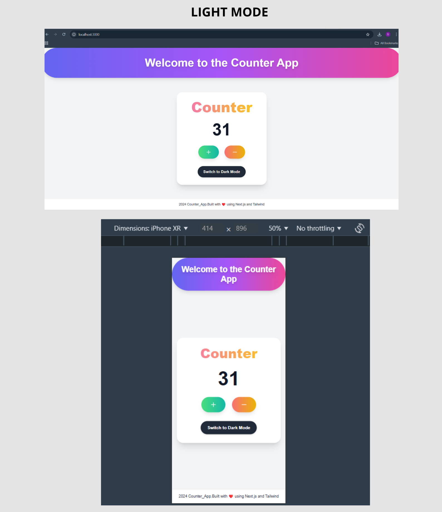
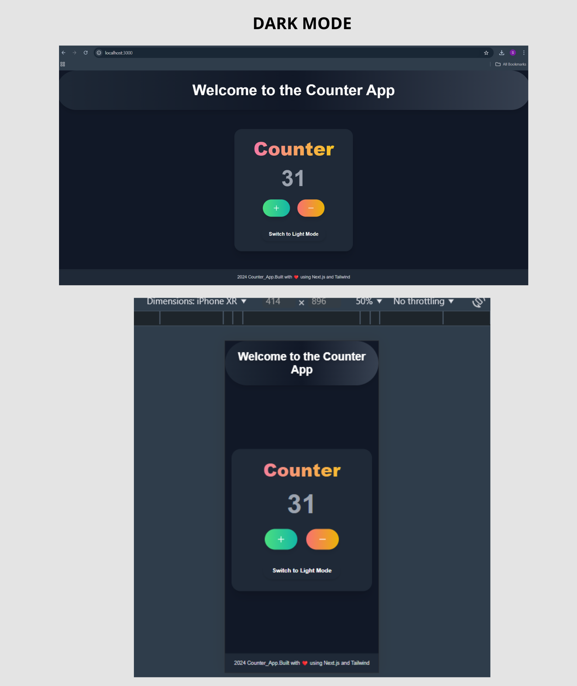

#  🎉 Counter App with Dark Mode 🌙

Welcome to the **Counter App**, a responsive and feature-rich web application built using **Next.js** and **Tailwind CSS**. This app offers an interactive counter with a sleek user interface and support for dark mode.

## 📜 Features

- **Increment & Decrement Counter🔢:** The app allows you to increment and decrement the counter. The counter starts at 0, and you can adjust it up or down using 
                                      the buttons.
- **Dark Mode Toggle 🌙**: Switch between light and dark themes seamlessly.
- **Persistent State 💾**: Your counter value is saved in `localStorage`, which means you won’t lose your progress even if you refresh the page or close the 
                            browser.
- **Responsive Design 📱💻**: Optimized for devices of all screen sizes.

## 🛠️ Technologies Used 

- **Next.js**: Framework for building server-rendered React applications.
- **Tailwind CSS**: Utility-first CSS framework for styling.
- **React Hooks**: Manage state and side effects effectively.

## 🚀 Installation

Follow these steps to set up the project locally:

1. Clone the repository:
   ```bash
   git clone https://github.com/sanika-ghadage/counter
   ```

2. Navigate to the project directory:
   ```bash
   cd counter
   ```

3. Install dependencies:
   ```bash
   npm install
   ```

4. Start the development server:
   ```bash
   npm run dev
   ```

5. Open your browser and go to `http://localhost:3000` to see the app in action.

## Usage

### Counter🔢 
- Click the **`+`** button to increment the counter.
- Click the **`-`** button to decrement the counter (minimum value is 0).

### Dark Mode 🌙🌞
- Click the "Switch to Dark Mode" button to enable dark mode.
- Click "Switch to Light Mode" to return to the default light mode.

## Code Overview

### Main Components

- **Counter**: The core component that contains the counter logic, buttons, and dark mode toggle.
- **Home**: The landing page that renders the `Counter` component.

### Key Features in Code

- **Dark Mode**:
  ```js
  const toggleDarkMode = () => {
    setDarkMode(!darkMode);
    if (!darkMode) {
      document.documentElement.classList.add("dark");
    } else {
      document.documentElement.classList.remove("dark");
    }
  };
  ```

- **Persistent Counter State**:
  ```js
  useEffect(() => {
    const savedCounter = localStorage.getItem("Counter");
    if (savedCounter) {
      setCount(parseInt(savedCounter, 10));
    }
  }, []);

  useEffect(() => {
    localStorage.setItem("Counter", count);
  }, [count]);
  ```

## 🔥 Screenshots

### Light Mode


### Dark Mode


## 🖋️ Contributing

Contributions are welcome! If you find a bug or have an idea for a new feature:

1. Fork the repository.
2. Create a new branch for your feature or bugfix.
3. Commit your changes and open a pull request.

---

Built with ❤️ by [sanika_ghadage](https://github.com/sanika-ghadage).

